## Nodes and configuration points
```
├───config                          | Centralized Configuration
│   │   panda.urdf                  |
│   │   robot_config.yaml           |
│   └───ik                          |
│           environment.json        |
│           panda_collision.json    |
│           solver_config.yaml      | --
├───Actuation_Group                 | Module level launch files
│   └───launch                      |
│           Actuation.launch        |
│           actuation_test.launch   | --
├───collision_free_ik               | Runtime node dependencies
│   └───config                      |
│           environment.json        |
│           panda.urdf              |
│           panda_collision.json    |
│           solver_config.yaml      |
├───controlled_valve                |
│   └───nodes                       |
│           controlledValveNode     |
├───ft_sensor                       |
│   └───nodes                       |
│          ee_selector              |
│          ft_processor             |
├───hybrid_controller               |
│   └───msg                         |
│   │       HybridPose.msg          |
│   └───nodes                       |
│           hybrid_controller       |
├───kinect_ros                      |
│   └───launch                      |
│          kinect_launcher.launch   | --
├───franka_panda_description        |
├───franka_ros_interface            |
└───panda_sim                       |
```


# Usage

## Building and Configuring
To build all of the packages in this module, run `./compileActuation`. The packages in this module depend on the [`franka_ros`](https://github.com/frankaemika/franka_ros) installed in the ROS workspace (not included in this repo). This package is necessary even if you are running without a real robot.

Robot dynamic parameters, the URDF, environment description, robot collision models, and runtime IK solver configuration can all be modified using the files in the root level `config` folder. The default included launch file, `Actuation.launch`, pulls from that directory to load the necessary parameters. 

## Runtime Usage

Launching this module will spawn a group of nodes that serve to interface with the robot. 

```mermaid
flowchart LR;
    HP(Hybrid Pose)-->AG
    Pose(Pose)-->AG
    SetEE(Set EE)-->AG

    subgraph AG[Actuation Group]
        HAC[Hybrid Admittance Controller]
        IK[Inverse Kinematics]
        PC[Position Controller]
        
        HAC-->IK
        IK-->PC
    end
    
    AG-->JointCommand
    JointCommand(Joint Command)-.->Panda
    JointCommand(Joint Command)-.->PandaSim
    
    AG<-->RobotState
    subgraph RobotState[Published Robot State]
        JointState(JointState)
        FS(Franka State)
        Sensors(Sensors)

        JointState---FS
        FS---Sensors
    end

    classDef topics fill:#F4A261,color:black;
    classDef standard fill:#264653;
    class IK,HAC,PC,Or,PandaSim standard;
    class HP,Pose,JointState,FS,Sensors,SetEE,JointCommand topics;
```





By publishing to the exposed pose, or hybrid pose topics, the actuation group will publish to a resulting joint position command topic that is either fed into the simulated or real panda. The default end effector is specified in the `robot_config.yaml` file, but if you need to change the end effector on the fly, you can publish the new end joint to the Set EE topic (defualt name `/panda/set_ee`).

# Node Configuration

## Actuation Flowchart

```mermaid
  flowchart RL;
    LF[libfranka::Robot];
    franka_ros_interface-->LF;
    IK(Inverse Kinematics)-->franka_ros_interface;
    Admittance(Admittance Controller)-->IK;
    FTSensor(Force Torque Sensor)-->Admittance;
    HPInput(Hybrid Pose)-->Admittance;
    
    
    classDef topics fill:#F4A261,color:black;
    classDef editable fill:#b6c1cc,color:black;
    classDef standard fill:#264653;
    class LF,franka_ros_interface,IK,Admittance,FTSensor standard;
    class HPInput topics;
```


### Low Level Control (Joint Commands)

```mermaid
  flowchart RL;
      FCNTopics-->FRC;
      FGNTopics-->FGN;
      FRITopics-->CM;
      
      subgraph franka_ros_interface
        subgraph franka_ros
          CM{Controller Manager}:::standard;
          CM-->PJP[position_joint_position_controller]:::editable;
          CM-->EJP[effort_joint_position_controller]:::editable;
          CM-->etc[new controller here]:::editable;
        end
        
        FRC{franka_ros_control}:::standard;%%-->LF;
        FGN{franka_gripper}:::standard;%%-->LF;
      end
      
      franka_ros_interface-->LF;
      
      subgraph ROSInterface
        FCNTopics(Configuration Services):::topics;
        FGNTopics(Gripper Commands):::topics;
        FRITopics(Joint Commands):::topics;
      end
      
      LF[libfranka::Robot]:::standard;
      
      classDef editable fill:#b6c1cc,color:black;
      classDef standard fill:#264653;
      classDef topics fill:#F4A261,color:black;
      class ROSControl standard;
      class franka_ros standard;
```


Documentation for the dependency nodes:
* [libfranka](https://frankaemika.github.io/docs/libfranka.html)
* [franka_control](https://frankaemika.github.io/docs/franka_ros.html#franka-control)
* [franka_gripper](https://frankaemika.github.io/docs/franka_ros.html#franka-gripper)

[franka_ros_interface](https://github.com/justagist/franka_ros_interface) was forked, and this repo contains a minimally modified version.
